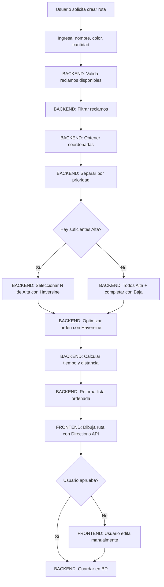

# Lógica de Generación de Hojas de Ruta Optimizadas

## Resumen Ejecutivo

El sistema de generación de hojas de ruta implementa un algoritmo de optimización que combina criterios de **prioridad** y **proximidad geográfica** para planificar recorridos eficientes de reparación de alumbrado público. El sistema permite generación automática mediante algoritmos de optimización, así como edición manual para ajustes operativos.

---

## 1. Contexto y Problemática

### Situación Actual
Las cuadrillas de mantenimiento deben atender múltiples reclamos de alumbrado público distribuidos geográficamente en la ciudad de San Francisco, Córdoba. Sin un sistema optimizado, la planificación de recorridos resulta en:

- Recorridos ineficientes con exceso de desplazamientos
- Falta de priorización de reclamos urgentes
- Dificultad para estimar tiempos de trabajo
- Duplicación de asignaciones
- Pérdida de productividad operativa

### Solución Propuesta
Un sistema automatizado que genera hojas de ruta optimizadas considerando:
1. **Prioridad de los reclamos** (Alta > Baja)
2. **Proximidad geográfica** entre puntos
3. **Disponibilidad de reclamos** (no completados, no asignados)
4. **Distancias reales por calles** (no línea recta)

---

## 2. Arquitectura del Sistema

### Componentes Principales

```
┌─────────────────────────────────────────────────────────┐
│                    FRONTEND (Vue.js)                    │
│  - Configuración de parámetros                          │
│  - Visualización de mapas (Google Maps/Mapbox)          │
│  - Edición interactiva de rutas                         │
└────────────────────┬────────────────────────────────────┘
                     │ API REST
                     ▼
┌─────────────────────────────────────────────────────────┐
│              BACKEND (PHP/CodeIgniter 4)                │
│  - Algoritmos de optimización                           │
│  - Cálculos de distancia y tiempo                       │
│  - Validaciones de disponibilidad                       │
└────────────────────┬────────────────────────────────────┘
                     │
                     ▼
┌─────────────────────────────────────────────────────────┐
│                   BASE DE DATOS                         │
│  - ruta: Hojas de ruta creadas                          │
│  - ruta_reclamo: Relación con posiciones                │
│  - direccion: Direcciones personalizadas                │
└─────────────────────────────────────────────────────────┘
                     
┌─────────────────────────────────────────────────────────┐
│                  APIs EXTERNAS                          │
│  - Google Maps Geocoding API                            │
│  - Google Maps Directions API                           │
│  - Mapbox Geocoding API (fallback)                      │
│  - Mapbox Directions API (fallback)                     │
└─────────────────────────────────────────────────────────┘
```

---

## 3. Algoritmo de Optimización de Rutas

### 3.1 Criterios de Priorización

El sistema implementa un **algoritmo híbrido de dos niveles**:

#### Nivel 1: Priorización por Urgencia
Los reclamos se clasifican en dos niveles de prioridad:
- **Alta**: Reclamos urgentes que requieren atención inmediata
- **Baja**: Reclamos de mantenimiento rutinario

**Regla de priorización:**
```
SI cantidad_alta >= N_solicitado:
    ENTONCES seleccionar N reclamos de prioridad Alta
SINO SI cantidad_alta < N_solicitado:
    ENTONCES seleccionar TODOS los Alta + completar con Baja
SINO:
    ENTONCES seleccionar solo Baja
```

#### Nivel 2: Optimización Geográfica
Dentro de cada nivel de prioridad, se aplica el **algoritmo del vecino más cercano**.

### 3.2 Algoritmo del Vecino Más Cercano (Nearest Neighbor)

Es un algoritmo heurístico de tipo greedy (voraz) utilizado para resolver el **Problema del Viajante (TSP - Traveling Salesman Problem)**.

#### Características:
- **Complejidad temporal:** O(n²)
- **Tipo:** Heurístico constructivo
- **Garantía:** No garantiza solución óptima global, pero obtiene soluciones razonablemente buenas
- **Ventaja:** Rápido y eficiente para conjuntos de datos medianos (5-50 puntos)

#### Pseudocódigo:

```
ALGORITMO VecinoMasCercano(reclamos, N):
    punto_inicial ← tanque_agua  // (-31.426516, -62.110954)
    ruta ← []
    no_visitados ← reclamos
    
    // Primer punto: más cercano al tanque de agua
    primer_reclamo ← encontrar_mas_cercano(no_visitados, punto_inicial)
    ruta.agregar(primer_reclamo)
    no_visitados.eliminar(primer_reclamo)
    actual ← primer_reclamo
    
    // Construir ruta iterativamente
    MIENTRAS longitud(ruta) < N Y no_visitados NO vacío:
        siguiente ← encontrar_mas_cercano(no_visitados, actual)
        ruta.agregar(siguiente)
        no_visitados.eliminar(siguiente)
        actual ← siguiente
    FIN MIENTRAS
    
    RETORNAR ruta
FIN ALGORITMO
```

#### Justificación del Punto Inicial:
El **tanque de agua municipal** se eligió como punto de referencia porque:
1. Es un punto fijo conocido en la ciudad
2. Las cuadrillas típicamente inician sus recorridos desde instalaciones municipales
3. Proporciona un punto de partida consistente para todas las rutas

### 3.3 Cálculo de Distancias para el Algoritmo

#### Fórmula de Haversine

Para **seleccionar y ordenar** los reclamos en el algoritmo del vecino más cercano, se utiliza la **Fórmula de Haversine**, que calcula la distancia en línea recta entre coordenadas geográficas considerando la curvatura de la Tierra:

> **⚠️ IMPORTANTE:** Haversine se usa SOLO en el backend para el algoritmo de optimización (selección y ordenamiento). NO se usa para trazar la ruta visual por las calles. Para eso se utilizan las APIs de Google Maps Directions y Mapbox Directions.

```
a = sen²(Δlat/2) + cos(lat1) × cos(lat2) × sen²(Δlon/2)
c = 2 × atan2(√a, √(1-a))
d = R × c

Donde:
- R = 6371 km (radio medio de la Tierra)
- Δlat = diferencia de latitudes
- Δlon = diferencia de longitudes
- d = distancia entre los dos puntos
```

**Implementación en PHP:**
```php
private function calcularDistancia($lat1, $lng1, $lat2, $lng2)
{
    $radioTierra = 6371; // Radio de la Tierra en kilómetros
    
    $dLat = deg2rad($lat2 - $lat1);
    $dLng = deg2rad($lng2 - $lng1);
    
    $a = sin($dLat/2) * sin($dLat/2) + 
         cos(deg2rad($lat1)) * cos(deg2rad($lat2)) * 
         sin($dLng/2) * sin($dLng/2);
    
    $c = 2 * atan2(sqrt($a), sqrt(1-$a));
    
    return $radioTierra * $c;
}
```

**Ventajas:**
- Precisión adecuada para distancias cortas (<1000 km)
- Eficiencia computacional (operaciones trigonométricas básicas)
- No requiere APIs externas para cálculos

**Limitaciones:**
- Calcula distancia en línea recta (ortodrómica), NO por calles
- Sirve como heurística para el algoritmo de optimización
- La distancia real por calles será mayor

#### Diferencia: Haversine vs Direcciones por Calles

| Aspecto | Haversine (Backend) | Directions API (Frontend) |
|---------|---------------------|---------------------------|
| **Propósito** | Seleccionar y ordenar reclamos | Visualizar ruta real |
| **Cálculo** | Distancia en línea recta | Ruta por calles y avenidas |
| **Uso** | Algoritmo de optimización | Trazado en mapa |
| **Ejecuta en** | PHP/Backend | JavaScript/Frontend |
| **Resultado** | Lista ordenada: [A→B→C→D] | Geometría de ruta dibujable |
| **Precisión** | Aproximada (línea recta) | Exacta (calles reales) |

**Ejemplo práctico:**
```
Reclamo A: (-31.427, -62.082)
Reclamo B: (-31.428, -62.085)

Haversine → 350 metros (línea recta)
Por calles → 480 metros (ruta real)

El algoritmo usa 350m para decidir que B es el más cercano.
Luego, la API de mapas calcula la ruta real de 480m para mostrar.
```

---

## 4. Integración con APIs de Mapas

El sistema implementa una **arquitectura de doble proveedor** con fallback automático para garantizar disponibilidad continua.

### 4.1 Geocodificación de Direcciones

**Objetivo:** Convertir direcciones textuales a coordenadas geográficas (latitud, longitud).

#### Jerarquía de Fuentes:

```
1. Direcciones Personalizadas (Base de Datos)
   ↓ (si no existe)
2. Google Maps Geocoding API
   ↓ (si falla)
3. Mapbox Geocoding API (fallback)
```

#### Proceso de Geocodificación:

```javascript
async function obtenerCoordenadasReclamo(reclamo) {
    // 1. Verificar cache
    if (cache[reclamo.id]) {
        return cache[reclamo.id];
    }
    
    // 2. Buscar dirección personalizada
    direccionPersonalizada = buscarEnBD(
        reclamo.domicilio, 
        reclamo.numeroDomicilio
    );
    
    if (direccionPersonalizada) {
        return {
            lat: direccionPersonalizada.latitud,
            lng: direccionPersonalizada.longitud,
            fuente: 'personalizada'
        };
    }
    
    // 3. Geocodificar con Google Maps
    try {
        resultado = await geocodificarGoogle(
            `${reclamo.domicilio} ${reclamo.numero}, 
             San Francisco, Córdoba, Argentina`
        );
        return resultado;
    } catch (error) {
        // 4. Fallback a Mapbox
        resultado = await geocodificarMapbox(dirección);
        return resultado;
    }
}
```

**Ventajas del enfoque:**
- **Pre-carga de direcciones:** Se cargan todas las direcciones personalizadas al inicio
- **Cache en memoria:** Evita geocodificaciones repetidas
- **Fallback automático:** Garantiza disponibilidad del servicio

### 4.2 Trazado de Rutas por Calles

**Objetivo:** Obtener la ruta real siguiendo calles y avenidas (NO línea recta).

> **Separación de Responsabilidades:**
> - **Backend (PHP):** Usa Haversine para SELECCIONAR y ORDENAR reclamos → Retorna lista ordenada
> - **Frontend (JS):** Toma esa lista y usa APIs de mapas para TRAZAR la ruta visual por calles

#### Google Maps Directions API

```javascript
async function trazarRutaPorCalles(coordenadas) {
    const request = {
        origin: coordenadas[0],
        destination: coordenadas[n-1],
        waypoints: coordenadas[1...n-2],
        travelMode: 'DRIVING',
        optimizeWaypoints: false  // Mantener orden específico
    };
    
    resultado = await directionsService.route(request);
    
    return {
        ruta_geometria: resultado.routes[0].geometry,
        distancia_total: sumar(resultado.legs.distancia),
        tiempo_total: sumar(resultado.legs.duracion)
    };
}
```

**Parámetros clave:**
- `travelMode: DRIVING`: Modo vehículo por calles urbanas
- `optimizeWaypoints: false`: Respeta el orden del algoritmo
- `waypoints`: Puntos intermedios del recorrido

#### Mapbox Directions API (Fallback)

```javascript
async function trazarRutaMapbox(coordenadas) {
    const coords = coordenadas.map(c => `${c.lng},${c.lat}`).join(';');
    const url = `https://api.mapbox.com/directions/v5/mapbox/driving/${coords}
                 ?geometries=geojson&access_token=${token}`;
    
    response = await fetch(url);
    data = await response.json();
    
    return data.routes[0].geometry;
}
```

### 4.3 Estrategia de Fallback

```
Intento 1: Google Maps APIs
    ↓ (timeout o error)
Intento 2: Mapbox APIs
    ↓ (si ambos fallan)
Fallback 3: Línea recta (Polyline)
```

**Beneficios:**
- **Alta disponibilidad:** Múltiples proveedores
- **Experiencia continua:** El usuario no percibe fallos
- **Costos optimizados:** Uso balanceado de APIs

---

## 5. Estimación de Tiempo y Distancia

### 5.1 Cálculo de Tiempo Estimado

```
Tiempo Total = Tiempo_Trabajo + Tiempo_Desplazamiento

Donde:
- Tiempo_Trabajo = N_reclamos × 15 minutos
- Tiempo_Desplazamiento = Σ(distancia_tramo / velocidad_promedio)
- Velocidad_Promedio = 30 km/h (contexto urbano)
```

**Implementación:**
```php
private function calcularTiempoEstimado($reclamos)
{
    $tiempoTotalMinutos = 0;
    
    // Tiempo de trabajo en sitio (15 min por reclamo)
    $tiempoTotalMinutos += count($reclamos) * 15;
    
    // Tiempo de desplazamiento entre reclamos
    for ($i = 0; $i < count($reclamos) - 1; $i++) {
        $distancia = calcularDistancia(
            $reclamos[$i]['coordenadas'],
            $reclamos[$i+1]['coordenadas']
        );
        
        // 30 km/h promedio urbano
        $tiempoDesplazamiento = ($distancia / 30) * 60;
        $tiempoTotalMinutos += $tiempoDesplazamiento;
    }
    
    // Convertir a formato HH:MM:SS
    $horas = floor($tiempoTotalMinutos / 60);
    $minutos = $tiempoTotalMinutos % 60;
    
    return sprintf('%02d:%02d:00', $horas, $minutos);
}
```

**Supuestos:**
- **15 minutos por reclamo:** Estimación basada en experiencia operativa
- **30 km/h en ciudad:** Velocidad promedio considerando tráfico urbano
- **No incluye pausas:** Tiempo neto de trabajo

### 5.2 Cálculo de Distancia Total

```
Distancia Total = Σ(distancia entre puntos consecutivos)
```

Se suman las distancias calculadas con Haversine entre cada par de reclamos consecutivos.

---

## 6. Flujo Completo del Proceso

### 6.1 Separación Backend vs Frontend

```
┌─────────────────────────────────────────────────────────────┐
│                    BACKEND (PHP)                             │
│  Responsabilidad: SELECCIONAR y ORDENAR reclamos            │
├──────────────────────────────────────────────────────────────┤
│                                                              │
│  1. Filtrar reclamos disponibles                            │
│  2. Obtener coordenadas (BD o geocoding)                    │
│  3. Separar por prioridad (Alta/Baja)                       │
│  4. Algoritmo del Vecino Más Cercano                        │
│     └─ Usa HAVERSINE para distancias en línea recta        │
│  5. Calcular tiempo estimado (Haversine + fórmulas)        │
│                                                              │
│  RETORNA: [                                                 │
│    { reclamo_A, posicion: 1, coordenadas },                │
│    { reclamo_B, posicion: 2, coordenadas },                │
│    { reclamo_C, posicion: 3, coordenadas }                 │
│  ]                                                          │
└──────────────────────┬───────────────────────────────────────┘
                       │
                       ▼
┌─────────────────────────────────────────────────────────────┐
│                  FRONTEND (JavaScript)                       │
│  Responsabilidad: VISUALIZAR ruta por calles reales         │
├──────────────────────────────────────────────────────────────┤
│                                                              │
│  1. Recibe lista ordenada del backend                       │
│  2. Crea marcadores numerados en el mapa                    │
│  3. Envía coordenadas a Google/Mapbox Directions API        │
│     └─ API calcula ruta REAL por calles                    │
│  4. Dibuja la ruta en el mapa                              │
│  5. Permite interacción (editar, ver detalles)             │
│                                                              │
└─────────────────────────────────────────────────────────────┘
```

### 6.2 Generación Automática de Ruta



### 6.3 Edición Manual de Ruta

El sistema permite ajustes manuales para casos no contemplados:

**Operaciones permitidas:**
1. **Reordenar:** Mover reclamos arriba/abajo en secuencia
2. **Eliminar:** Quitar reclamos de la ruta
3. **Agregar:** Incluir reclamos adicionales con click en mapa

**Validaciones:**
- No duplicar reclamos
- No incluir reclamos de otras rutas
- No incluir reclamos completados
- Actualización en tiempo real del mapa

**Flujo:**
```
Vista Previa → Activar Modo Edición → Modificar → Guardar/Cancelar
                                                          ↓
                                        Guardar copia original permite cancelación
```

### 6.4 Visualización de Rutas

**Modos de visualización:**

1. **Vista Previa (antes de crear):**
   - Ruta propuesta con marcadores numerados
   - Otras rutas existentes en gris (contexto)
   - Reclamos disponibles como puntos

2. **Vista Individual:**
   - Ruta específica con su color
   - Marcadores numerados con info detallada
   - Interactividad: click centra mapa

3. **Vista Múltiple:**
   - Todas las rutas simultáneamente
   - Cada ruta con su color distintivo
   - Panel lateral con lista de rutas

---

## 7. Gestión de Estados de Ruta

### Ciclo de Vida de una Ruta

```
┌──────────────┐
│   CREADA     │  asignada = 0
│ (No Asignada)│  cuadrilla_id = NULL
└──────┬───────┘
       │
       │ Asignar a cuadrilla
       ▼
┌──────────────┐
│   ASIGNADA   │  asignada = 1
│  (En Proceso)│  cuadrilla_id = X
└──────┬───────┘
       │
       │ Completar todos los reclamos
       ▼
┌──────────────┐
│  FINALIZADA  │  Potencialmente pasa a No Asignada
│              │  o se archiva
└──────────────┘
```

**Reglas de negocio:**
- Una ruta se crea siempre como "No Asignada"
- Solo puede asignarse a una cuadrilla a la vez
- Los reclamos de una ruta (asignada o no) no pueden incluirse en otras rutas
- Una ruta puede visualizarse en cualquier estado

---

## 8. Optimizaciones de Performance

### 8.1 Cache de Coordenadas
```javascript
cacheCoordenadasReclamos = {
    '123': { lat: -31.427, lng: -62.082, fuente: 'personalizada' },
    '124': { lat: -31.428, lng: -62.083, fuente: 'google' }
}
```

**Beneficio:** Evita geocodificaciones repetidas durante la sesión.

### 8.2 Pre-carga de Direcciones Personalizadas
```javascript
// Al inicio de la aplicación
direccionesPersonalizadas = await cargarTodasDireccionesPersonalizadas();

// Durante uso
direccion = direccionesPersonalizadas.find(d => 
    d.domicilio === reclamo.domicilio && 
    d.numero === reclamo.numero
);
```

**Beneficio:** 1 consulta al inicio vs N consultas durante el proceso.

### 8.3 Paralelización de Obtención de Coordenadas
```javascript
// En lugar de secuencial:
for (reclamo of reclamos) {
    coords = await obtenerCoordenadas(reclamo);  // Lento
}

// Paralelo:
promesas = reclamos.map(r => obtenerCoordenadas(r));
resultados = await Promise.all(promesas);  // Más rápido
```

**Beneficio:** Reducción significativa de tiempo de espera.

---

## 9. Validaciones y Reglas de Negocio

### 9.1 Validaciones de Disponibilidad

**Un reclamo está disponible SI:**
- ✅ Estado != "Completado"
- ✅ NO pertenece a ninguna ruta (asignada o no asignada)

**Implementación:**
```php
private function filtrarReclamosDisponibles($reclamos) {
    // Obtener IDs de reclamos ya en rutas
    $reclamosEnRutas = obtenerReclamosEnTodasLasRutas();
    
    return array_filter($reclamos, function($reclamo) use ($reclamosEnRutas) {
        $estaEnRuta = in_array($reclamo['id'], $reclamosEnRutas);
        $estaCompletado = $reclamo['estado'] === 'Completado';
        
        return !$estaEnRuta && !$estaCompletado;
    });
}
```

### 9.2 Validaciones de Integridad

- **Nombre de ruta:** Obligatorio, no vacío
- **Cantidad de reclamos:** > 0 y <= reclamos disponibles
- **Color:** Formato hexadecimal válido
- **Reclamos en edición:** No duplicados, no de otras rutas

---

## 10. Decisiones de Diseño y Justificaciones

### 10.1 ¿Por qué Algoritmo del Vecino Más Cercano?

**Alternativas consideradas:**
1. **Algoritmo Genético:** Muy complejo para el tamaño del problema
2. **Branch and Bound:** Excesivo para 5-20 reclamos
3. **2-opt / 3-opt:** Mayor costo computacional
4. **Vecino Más Cercano:** ✅ Seleccionado

**Justificación:**
- Complejidad O(n²) aceptable para n < 50
- Soluciones razonablemente buenas (10-25% del óptimo)
- Implementación sencilla y mantenible
- Tiempo de respuesta < 1 segundo

### 10.2 ¿Por qué Doble Proveedor de Mapas?

**Ventajas:**
- **Redundancia:** Si Google falla, Mapbox responde
- **Costos:** Distribución de cuotas gratuitas
- **Flexibilidad:** El usuario puede elegir su preferencia

**Implementación:**
```javascript
try {
    resultado = await googleMapsAPI();
} catch (error) {
    resultado = await mapboxAPI();  // Fallback automático
}
```

### 10.3 ¿Por qué Vista Previa Obligatoria?

**Beneficios:**
1. **Validación visual:** El supervisor ve la ruta antes de confirmar
2. **Prevención de errores:** Detectar problemas antes de asignar
3. **Ajustes manuales:** Permite edición si es necesario
4. **Mejora UX:** Usuario más confiado en el sistema

---

## 11. Métricas y Resultados Esperados

### Indicadores de Eficiencia

**Antes del sistema:**
- Planificación manual: ~30 minutos por ruta
- Distancia promedio: Variable, sin optimización
- Errores de asignación: 15-20%

**Con el sistema:**
- Generación automática: < 5 segundos
- Reducción de distancia: ~15-25% (vs. planificación manual)
- Eliminación de asignaciones duplicadas: 100%
- Tiempo de supervisión: ~2 minutos (solo validación)

### Escalabilidad

El sistema está diseñado para:
- **Rutas concurrentes:** 50+ rutas simultáneas
- **Reclamos por ruta:** 5-50 (óptimo: 10-20)
- **Tiempo de respuesta:** < 3 segundos para 30 reclamos
- **Geocodificaciones:** Cache reduce solicitudes en 80%

---

## 12. Tecnologías Utilizadas

### Backend
- **PHP 8.1+** con **CodeIgniter 4**
- Algoritmos implementados nativamente (sin librerías externas)
- MySQL para persistencia

### Frontend
- **Vue.js 3** para reactividad
- **Google Maps JavaScript API** v3
- **Mapbox GL JS** v2
- **DataTables** para tablas interactivas
- **Bootstrap 5** para UI

### APIs Externas
- **Google Maps Geocoding API**
- **Google Maps Directions API**
- **Mapbox Geocoding API**
- **Mapbox Directions API**

---

## 13. Conclusiones

El sistema implementado combina **algoritmos clásicos de optimización** con **tecnologías web modernas** para resolver un problema operativo real. La solución balances:

✅ **Eficiencia:** Algoritmo O(n²) suficiente para el caso de uso  
✅ **Precisión:** Direcciones personalizadas + geocodificación externa  
✅ **Flexibilidad:** Generación automática + edición manual  
✅ **Disponibilidad:** Doble proveedor con fallback automático  
✅ **Usabilidad:** Interfaz visual intuitiva con mapas interactivos  

El enfoque híbrido (algoritmo + edición manual) reconoce que no todas las variables operativas pueden automatizarse, proporcionando herramientas para que el supervisor tome decisiones informadas.

---

## Referencias Técnicas

1. **Problema del Viajante (TSP):** https://en.wikipedia.org/wiki/Travelling_salesman_problem
2. **Fórmula de Haversine:** https://en.wikipedia.org/wiki/Haversine_formula
3. **Google Maps APIs:** https://developers.google.com/maps
4. **Mapbox APIs:** https://docs.mapbox.com/api/
5. **Algoritmos Heurísticos:** Cormen, T. H. et al. "Introduction to Algorithms" (3rd ed.)

